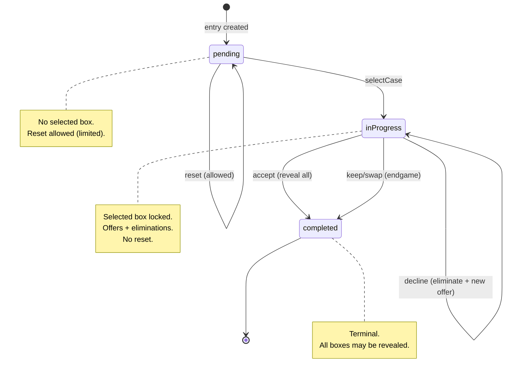
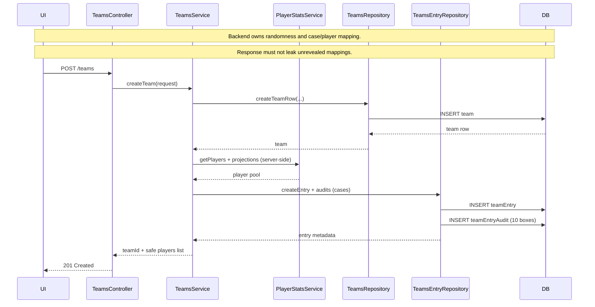
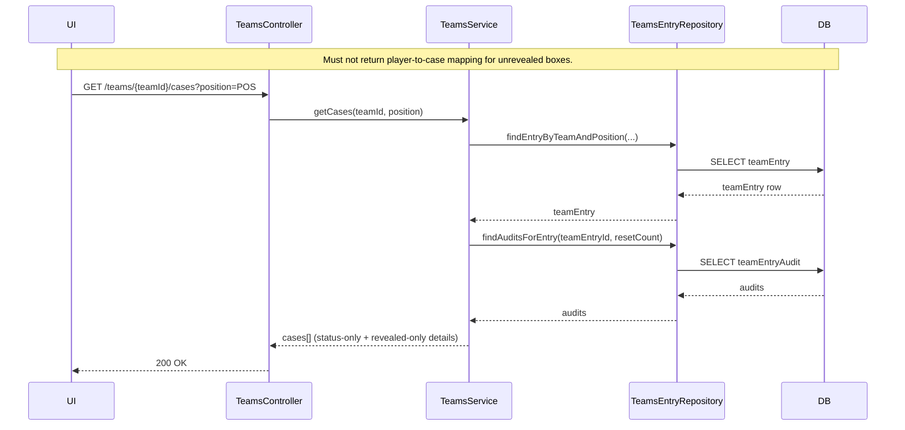
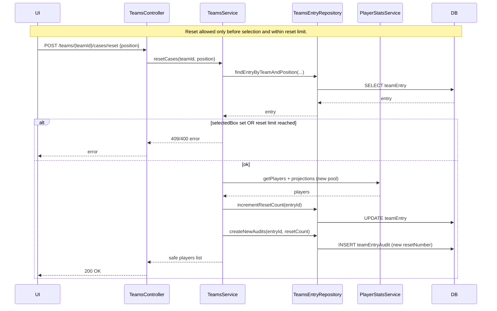
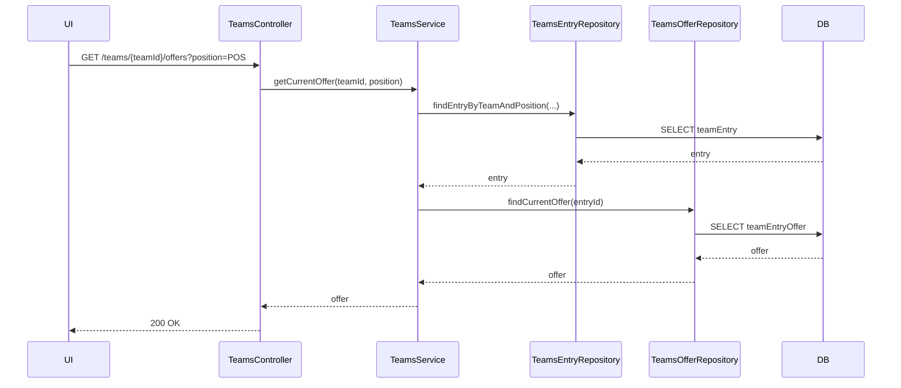
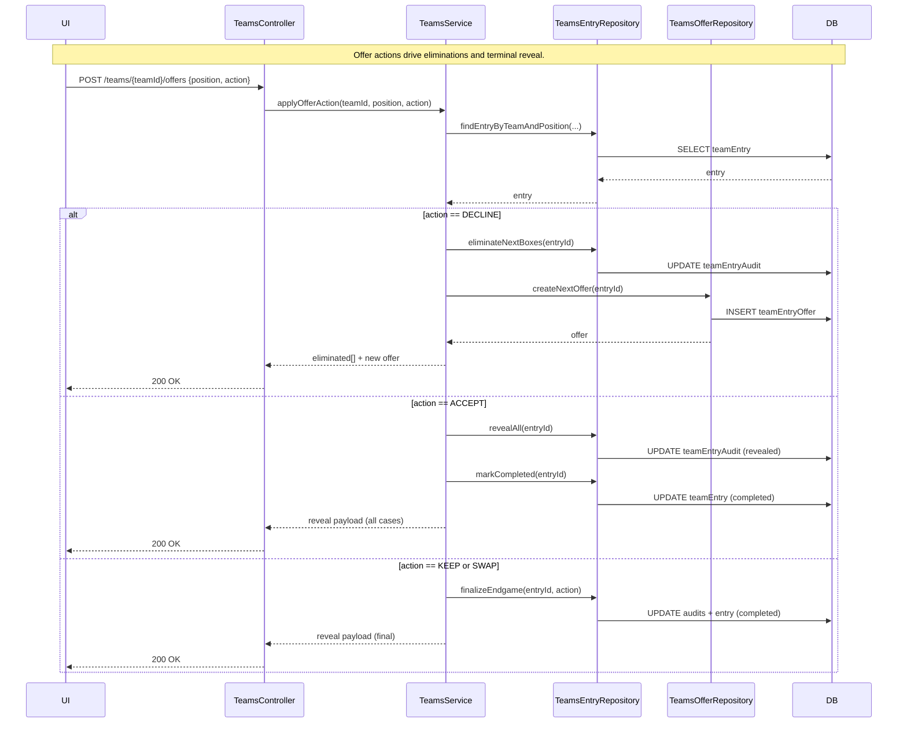
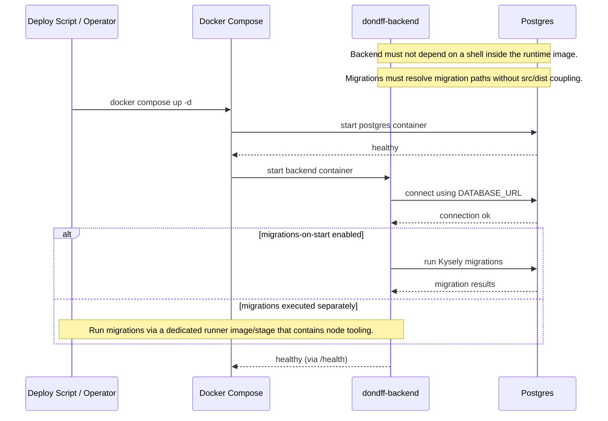
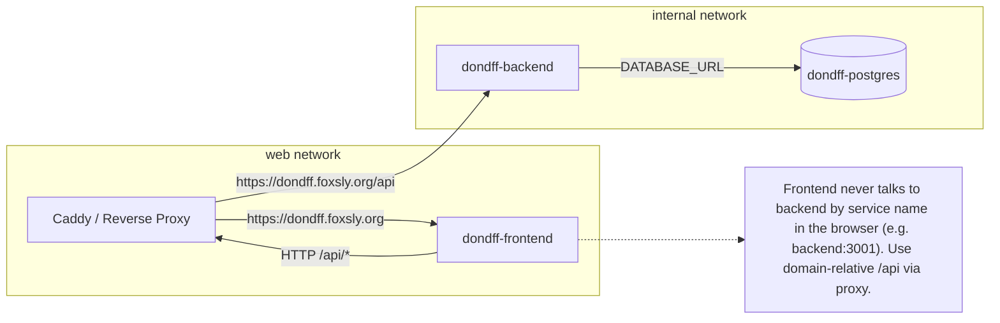

# Diagrams

This file contains Mermaid diagrams for the DONDFF backend and game flow.

## Backend layering

```mermaid
sequenceDiagram
  autonumber
  participant UI
  participant Controller
  participant Service
  participant Repo as Repository
  participant DB
  participant Sleeper as External API

  Note over UI,Sleeper: Controllers expose typed HTTP APIs via @TypedRoute.
  Note over Controller,Repo: Controllers call Services; Services call Repositories.
  Note over Repo,DB: Repositories are the only layer that executes SQL.

  UI->>Controller: HTTP request
  Controller->>Service: validate + delegate
  Service->>Sleeper: fetch external data (if needed)
  Service->>Repo: persistence / retrieval
  Repo->>DB: SQL via Kysely
  DB-->>Repo: rows
  Repo-->>Service: domain objects
  Service-->>Controller: response model (safe)
  Controller-->>UI: HTTP response
```

## Game state transitions



## POST /teams – create team + initialize cases



## GET /teams/{teamId}/cases – list cases without mapping



## POST /teams/{teamId}/cases – selectCase + initial eliminations + offer

```mermaid
sequenceDiagram
  participant UI
  participant TeamsController
  participant TeamsService
  participant TeamsEntryRepository
  participant TeamsOfferRepository
  participant DB

  Note over UI,DB: Selecting a case is a state transition; record audit/event.

  UI->>TeamsController: POST /teams/{teamId}/cases {position, action:selectCase, boxNumber}
  TeamsController->>TeamsService: selectCase(teamId, position, boxNumber)
  TeamsService->>TeamsEntryRepository: getEntryForUpdate(...)
  TeamsEntryRepository->>DB: SELECT teamEntry
  DB-->>TeamsEntryRepository: entry
  TeamsEntryRepository-->>TeamsService: entry

  alt selectedBox already set
    TeamsService-->>TeamsController: 409 Conflict
    TeamsController-->>UI: error
  else ok
    TeamsService->>TeamsEntryRepository: setSelectedBox(entryId, boxNumber)
    TeamsEntryRepository->>DB: UPDATE teamEntry
    TeamsService->>TeamsEntryRepository: eliminateInitialBoxes(entryId)
    TeamsEntryRepository->>DB: UPDATE teamEntryAudit (mark eliminated)
    TeamsService->>TeamsOfferRepository: createInitialOffer(entryId)
    TeamsOfferRepository->>DB: INSERT teamEntryOffer
    TeamsOfferRepository-->>TeamsService: offer
    TeamsService-->>TeamsController: eliminated[] + offer
    TeamsController-->>UI: 200 OK
  end
```

## POST /teams/{teamId}/cases/reset – reset before selection



## GET /teams/{teamId}/offers – current offer



## POST /teams/{teamId}/offers – accept/decline/keep/swap



## Backend startup + migrations (distroless-friendly)



## Docker Compose topology



## Frontend runtime configuration injection

```mermaid
sequenceDiagram
  participant Browser
  participant Frontend as dondff-frontend
  participant Proxy as Caddy
  participant Backend as dondff-backend

  Note over Browser,Backend: API base URL must be runtime-configurable; avoid hardcoding.

  Browser->>Frontend: GET /
  Frontend-->>Browser: index.html

  Browser->>Frontend: GET /runtime-env.js
  Frontend-->>Browser: window.RUNTIME_CONFIG = { API_BASE_URL: "/api" }

  Browser->>Proxy: GET /api/health
  Proxy->>Backend: forward /health
  Backend-->>Proxy: 200 OK
  Proxy-->>Browser: 200 OK

  Note over Browser,Proxy: Browser uses API base '/api' (domain-relative).
```

## Master compose include (multi-stack) – project/volume boundaries

```mermaid
sequenceDiagram
  participant Operator
  participant Master as ~/docker/docker-compose.yaml
  participant Stack as dondff/docker-compose.yaml
  participant Docker

  Note over Operator,Docker: When using a master compose with include, env/.env scope is based on where compose is executed.
  Note over Operator,Docker: Prefer explicit project name (-p dondff) or ensure env is loaded at the master level.

  Operator->>Docker: docker compose up -d (run from ~/docker)
  Docker->>Master: load includes
  Master->>Stack: include dondff stack
  Docker-->>Operator: containers/volumes created under one project namespace

  Note over Operator,Docker: Volume confusion happens when project naming changes; inspect mounts to confirm which volume is in use.
```
